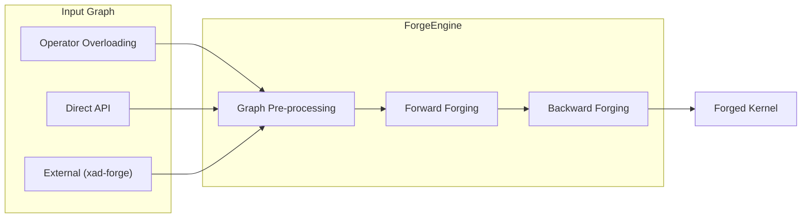

<div align="center">
  
  <h3>FORGE — Forward & Reverse Gradient Engine</h3>
  <p>High-performance JIT compilation for mathematical expressions with automatic differentiation</p>
</div>

<br/>

Forge compiles mathematical expressions to optimized x86-64 machine code with automatic gradient computation. It follows a **record-once, compile-once, evaluate-many** paradigm designed for workloads where the same computation is repeated with varying inputs.

## Key Features

- **JIT Compilation**: Generates native x86-64 machine code via [AsmJit](https://github.com/asmjit/asmjit)
- **Reverse-mode AD**: Automatic gradient computation for all recorded operations
- **Graph Optimizations**: Common subexpression elimination, constant folding, algebraic simplification
- **SIMD Backends**: SSE2 scalar (default) and AVX2 packed (4-wide), with extensible backend interface
- **Branching Support**: Record-time conditional evaluation via `fbool` and `If()` for data-dependent control flow

## Example

```cpp
#include <forge.hpp>

using namespace forge;

int main() {
    // Record computation: f(x) = x² + sin(x)
    GraphRecorder recorder;
    recorder.start();

    fdouble x(0.0);
    x.markInputAndDiff();
    fdouble result = square(x) + sin(x);
    result.markOutput();

    recorder.stop();
    Graph graph = recorder.graph();

    // Compile to machine code
    ForgeEngine compiler;
    auto kernel = compiler.compile(graph);
    auto buffer = NodeValueBufferFactory::create(graph, *kernel);

    // Evaluate with different inputs
    buffer->setValue(graph.diff_inputs[0], 2.0);
    kernel->execute(*buffer);

    double f_x = buffer->getValue(graph.outputs[0]);           // f(2.0)
    double df_dx = buffer->getGradient(graph.diff_inputs[0]);  // f'(2.0)
}
```

## When to Use Forge

Forge is designed for **repeated evaluation** scenarios:

- **Monte Carlo methods**: Pricing, XVA, path-dependent calculations
- **Scenario analysis**: Stress testing, what-if analysis, parameter sweeps
- **Sensitivities**: Fast gradient computation across input variations
- **Model calibration**: Repeated function/gradient evaluation during optimization

**Trade-off**: Forge incurs upfront compilation cost. For single evaluations, tape-based AD is faster. Break-even typically occurs after 10–50 evaluations depending on graph complexity.

## How It Works



| Stage | Description | Extensibility |
|-------|-------------|---------------|
| **Input Graph** | Three ways to create graphs | [Operator overloading](api/native/), [Direct API](src/graph/graph.hpp), [External transform](https://github.com/da-roth/xad-forge) |
| **Graph Pre-processing** | CSE, constant folding, algebraic simplification | [GraphOptimizer](src/graph/graph_optimizer.hpp) |
| **Forward Forging** | Generates forward pass machine code | [IInstructionSet](backends/), [ICompilationPolicy](src/compiler/interfaces/compilation_policy.hpp) |
| **Backward Forging** | Generates gradient pass (optional) | Same interfaces as forward |
| **Forged Kernel** | Executable kernel for repeated evaluation | — |

## Getting Started

```bash
git clone https://github.com/da-roth/forge.git
cd forge && mkdir build && cd build
cmake .. && cmake --build .
```

**CMake integration:**
```cmake
add_subdirectory(forge)
target_link_libraries(your_target PRIVATE forge::forge)
```

Requires C++17 and CMake 3.20+. All dependencies are fetched automatically.

## Documentation

| Resource | Description |
|----------|-------------|
| [examples/](examples/) | Working demonstrations |
| [api/native/](api/native/) | `fdouble`, `fbool`, `fint` operator overloading API |
| [src/graph/graph.hpp](src/graph/graph.hpp) | Direct Graph API and `OpCode` definitions |
| [backends/](backends/) | Backend implementation reference |

## SIMD Backends

Forge supports multiple instruction set backends:

```cpp
CompilerConfig config;
config.instructionSet = CompilerConfig::InstructionSet::AVX2_PACKED;
ForgeEngine compiler(config);
```

| Option | Default | Description |
|--------|---------|-------------|
| `FORGE_BUNDLE_AVX2` | ON | Bundle AVX2 backend into library |
| `FORGE_BUILD_AVX2_BACKEND` | OFF | Build AVX2 as loadable shared library |

Backends can also be loaded at runtime:
```cpp
InstructionSetFactory::loadBackend("./libforge_avx2.so");
```

## License

Zlib License. See [LICENSE.md](LICENSE.md).

## Related Projects

- [xad-forge](https://github.com/da-roth/xad-forge) — Forge JIT backend for [XAD](https://github.com/auto-differentiation/xad)

## Acknowledgments

- [AsmJit](https://github.com/asmjit/asmjit) — Machine code generation
- [MathPresso](https://github.com/kobalicek/mathpresso) — JIT expression compilation inspiration
- [SLEEF](https://github.com/shibatch/sleef) — Vectorized transcendental functions
